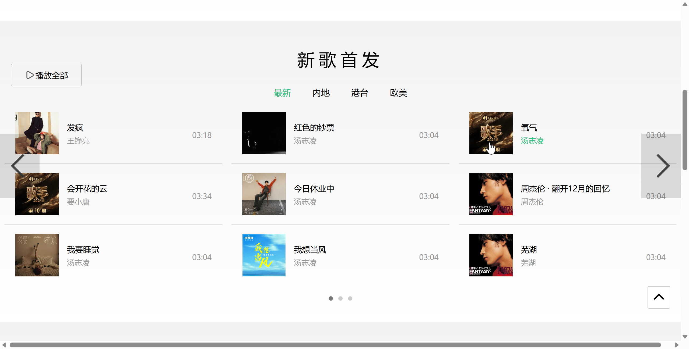
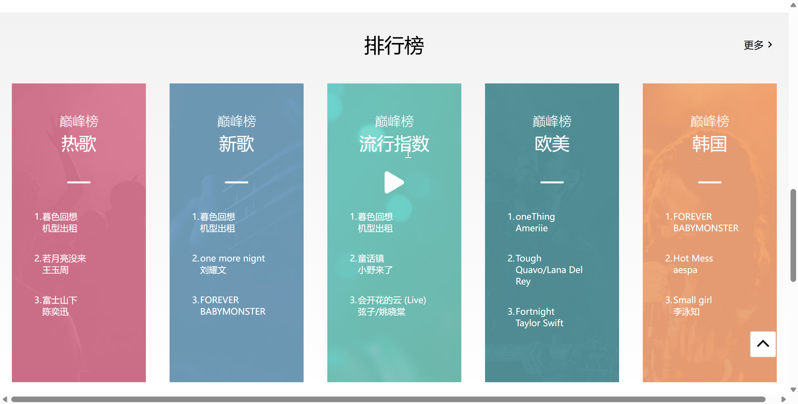
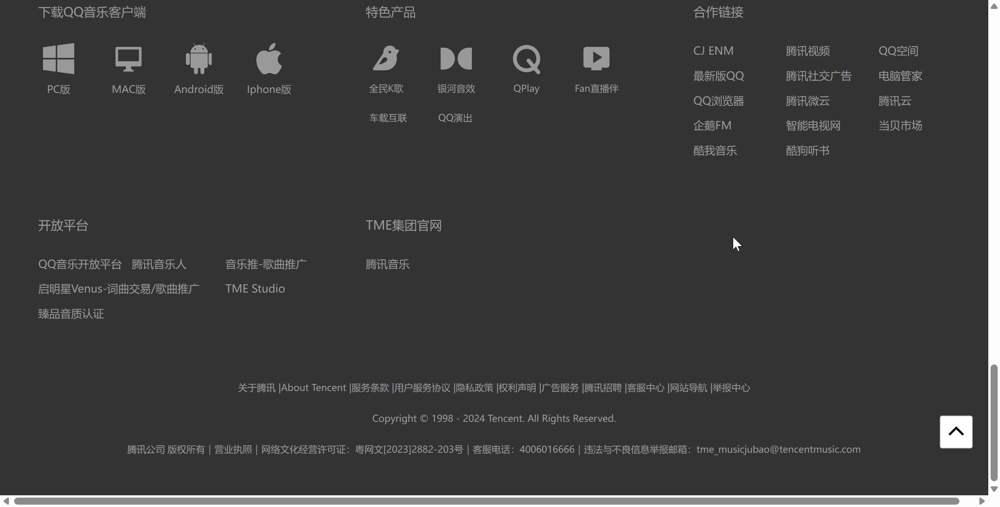

# summer_project

此项目仅为个人练习项目，对QQ音乐web端进行了静态页面的仿制

技术栈：Vue3+VueRouter+Pinia

# 项目截图
**路由部分可正常切换但仅对首页部分的静态页面进行了仿制**
## 歌单推荐
*实现了歌单推荐部分的轮播图功能以及图片悬浮放大，按钮出现等细节*


## 新歌首发
*与上一部分功能基本相同*


## 排行榜


## Footer



## 项目启动

```sh
pnpm install
```

### Compile and Hot-Reload for Development

```sh
pnpm dev
```

### Compile and Minify for Production

```sh
pnpm build
```

### Lint with [ESLint](https://eslint.org/)

```sh
pnpm lint
```
# QQmusic
